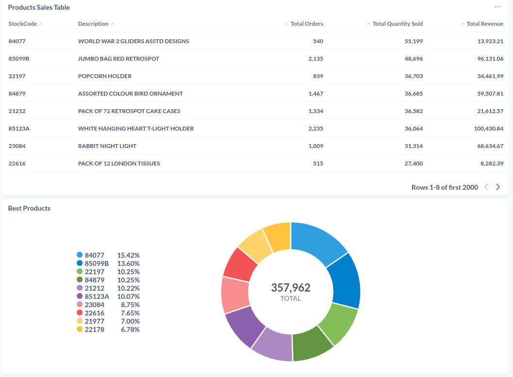

## 📊 Sales Analytics Dashboard
[](http://34.13.225.198/public/dashboard/5a88b15e-173c-4917-a8d5-e12bb66cc936)

*Click image to view interactive dashboard*

# E-commerce Analytics Pipeline

A comprehensive data pipeline for processing, analyzing, and visualizing retail data using Apache Airflow, Spark, dbt, BigQuery, and Metabase.

## Overview

This project implements an end-to-end data pipeline for e-commerce analytics, enabling retail businesses to:

- Process and clean raw e-commerce transactional data
- Perform RFM (Recency, Frequency, Monetary) customer segmentation
- Transform and model data using dbt
- Load data into Google BigQuery for analysis
- Visualize insights using Metabase

## Architecture

```
Raw Data → Spark Processing → Google Cloud Storage → BigQuery → dbt Transformation → Metabase
```

The pipeline is orchestrated using Apache Airflow with Astronomer Runtime.

## Components

### Data Processing

- **Apache Spark**: Used for data cleaning, transformation, and RFM analysis
- **PySpark**: Python API for Spark that handles data processing tasks

### Data Storage & Warehousing

- **Google Cloud Storage**: Stores processed data in Parquet format
- **Google BigQuery**: Data warehouse for running analytical queries

### Orchestration & Transformation

- **Apache Airflow**: Orchestrates the entire pipeline
- **dbt (data build tool)**: Manages data transformations and modeling
- **Cosmos**: Airflow provider for dbt integration

### Visualization

- **Metabase**: Business intelligence tool for visualizing data insights

## DAGs (Airflow Workflows)

The project contains three main Airflow DAGs:

1. **Initial Setup DAG (`retail_initial_setup_dag.py`)**: 
   - Processes all historical data
   - Performs data cleaning
   - Calculates RFM segmentation
   - Writes results to GCS

2. **Bucket to BigQuery DAG (`bucket_to_gbq_dag.py`)**: 
   - Loads processed data from GCS to BigQuery
   - Handles both clean retail data and RFM analysis data

3. **dbt Transform DAG (`dbt_transform_dag.py`)**: 
   - Runs dbt models to transform data in BigQuery
   - Creates analytics tables for various business metrics

## Data Models

The dbt project includes several models for different analytical views:

- **Staging**: `stg_invoices` prepares and cleans raw data
- **Facts**: `fct_clean_sales`, `fct_returns_analysis` contain core sales data with returns processing
- **Dimensions**: `customers`, `products` provide entity data
- **Analytics**: `daily_sales`, `monthly_sales`, `sales_region` provide business metrics

## Returns Analysis

The pipeline includes sophisticated logic for matching returned items with original purchases:
- Identifies exact matches, item matches, and unmatched returns
- Classifies transactions as valid sales, matched returns, orphan returns, or unmatched returns

## Setup & Deployment

### Prerequisites

- Docker and Docker Compose
- Google Cloud Platform account with:
  - BigQuery enabled
  - Storage bucket created
  - Service account with appropriate permissions

### Configuration

1. Service account JSON key should be placed at:
   ```
   /usr/local/airflow/include/service_account.json
   ```

2. GCP resources needed:
   - Project: `project-id`
   - Dataset: `dataset_id`
   - Bucket: `bucket_name`

### Running the Project

1. Start the environment:
   ```bash
   astro dev start
   ```

2. Access Airflow UI at `http://localhost:8080`

3. Run DAGs in sequence:
   - First: `retail_initial_setup_dag`
   - Second: `retail_bucket_to_bq_dag`
   - Third: `retail_dbt_transform_dag`

4. Access Metabase at `http://localhost:3000` for visualizations

## Project Structure

```
project/
├── Dockerfile                      # Custom Docker image definition
├── docker-compose.override.yml     # Docker compose overrides for Metabase
├── dags/                           # Airflow DAGs
│   ├── bucket_to_gbq_dag.py        # GCS to BigQuery DAG
│   ├── cosmos_config.py            # Configuration for Cosmos dbt integration
│   ├── dbt_transform_dag.py        # dbt transformation DAG
│   ├── initial_setup_dag.py        # Initial data processing DAG
│   ├── retail_pipeline.py          # Spark processing functions
│   └── dbt/                        # dbt project
│       └── dbt_project/            # dbt models and configuration
│           ├── dbt_project.yml     # dbt project configuration
│           ├── models/             # dbt models
│           ├── packages.yml        # dbt package dependencies
│           └── profiles.yml        # dbt connection profiles
├── include/                        # Supporting files
│   ├── service_account.json        # GCP service account credentials
│   └── metabase/                   # Metabase data directory
```

## Development

### Adding New Models

1. Create new SQL files in the appropriate directory under `dags/dbt/dbt_project/models/`
2. Update `schema.yml` with metadata for the new models
3. Update `sources.yml` if new source tables are added

### Extending the Pipeline

To process new data sources:
1. Modify `retail_pipeline.py` to include additional processing functions
2. Update the DAGs to incorporate new processing steps
3. Add new dbt models for the additional data

## Monitoring & Maintenance

- Airflow provides monitoring of pipeline execution
- dbt tests validate data quality
- Metabase dashboards visualize pipeline results

